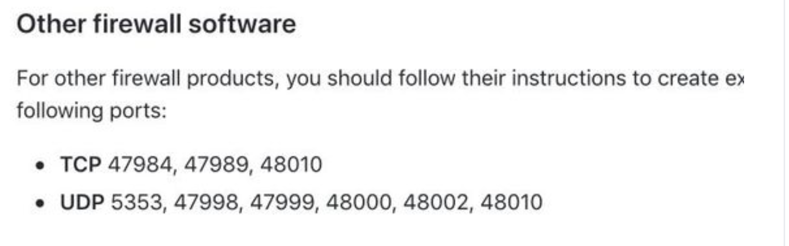

# 手机玩魔兽世界

## quick start

### 英伟达串流

原理很简单，可以简单理解成远程桌面玩游戏，重点是就是英伟达从显卡级别将渲染数据通过网络发送到客户端上，延迟低，对网络的要求高，占用带宽大且要求延迟低

户外4g没啥压力，不过费流量 1080P 60fps 需要20mbps 720p 60fps 需要10mbps 

[具体教程](https://www.iplaysoft.com/moonlight-stream.html)

### 手机按键映射

moonlight客户端有虚拟按键，可以外界手柄，如果是IOS的系统，只能使用MFI协议的手柄，我自己买的是 [这款](https://item.taobao.com/item.htm?spm=a1z09.2.0.0.47872e8d5G9qO2&id=582775143593&_u=d3td1r106a1)

然后要解决手机按键映射成电脑键盘鼠标的按键，需要安装xpadder软件，自行寻找破解版。

按键设置技巧提示

1. R1 R2 L1 L2是手柄最容易按的键位，推荐设置最常用的技能，比如一键输出/坦克/治疗，tab切换目标 拦截啥的，必要时可以设置按住连发功能，按住就等于一直按某个技能，适合一键输出等插件宏

2. 左轮盘设置wasd

3. 右轮盘设置鼠标移动

4. start 键设置按住鼠标右键，这样拖动右滚轮是在按住鼠标右键移动窗口

5. 其他按键根据需要自行映射

### 外网穿透

接下来需要解决在户外玩游戏，需要外网穿透

1.如果你家宽带是独立公网Ip的话 推荐使用路由器自带端口映射或者RMZ，moonlight端口占用如下：

2.如果你家宽带不是独立的话,请自行google 内网穿透，我家是独立Ip，哈哈

最后你需要花生壳绑定域名，避免Ip更变导致无法正常游戏

### 远程桌面

远程桌面是为了方便用手机开启各种软件，比如加速器，xpadder等软件

推荐使用 teamviewer 或者 vncserver，不要用软件自带的远程桌面，因为他会注销当前用户

### 显卡欺骗器

由于windows的限制，显卡必须连接显示器，为了可以关闭显示器，你需要一个显卡欺骗器，是一个虚拟的usb显示器，可以切换显示器，切换到显卡欺骗器就可以关闭显示器了，[淘宝地址](https://detail.tmall.com/item.htm?id=564633453403&spm=a1z09.2.0.0.47872e8d5G9qO2&_u=d3td1r1a69a)

### 远程开机

为了节约用电，最好当需要玩的时候远程开机。

*  主板支持

设置bios开启远程唤醒，然后用Linux的路由器安装唤醒插件给主板发送指令唤醒，[具体教程](https://www.znds.com/tv-948915-1-1.html)

*  主板不支持

如果主板不支持，可以购买一个[开机卡](https://item.taobao.com/item.htm?spm=a1z09.2.0.0.47872e8d5G9qO2&id=560152732327&_u=d3td1r1494f)插入主板，自带唤醒软件

## 使用总结

1. 通过路由器远程开机

2. 用过teamviewer 或者 vnc 开启远程桌面开启加速器和xpadder

3. 打开moonlight开启wow

4. 通过moonlight或者远程桌面关机

  

